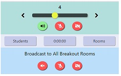

# Gathering using Breakout Rooms Extension

## Moderator Setup

1. Install [Google Meet Breakout Rooms extension by Robert Hudek](https://chrome.google.com/webstore/detail/google-meet-breakout-room/kogfdlbehkaeoafmgaecphlnhohpabig?hl=en)

2. Go to the Settings tab and check on the "Automatically Allow 'Outside' Participants Enter"

   

3. In the Courses tab, create a course "Gathering 1"

   

4. In the Rooms tab, choose the course "Gathering 1" and create 10 breakout rooms

   

5. In the Rooms tab, export these 10 breakout rooms and send this JSON file to all the participants

   

   popup window

   

## Participants Setup

1. Install [Google Meet Breakout Rooms extension by Robert Hudek](https://chrome.google.com/webstore/detail/google-meet-breakout-room/kogfdlbehkaeoafmgaecphlnhohpabig?hl=en)

2. In the Rooms tab, use the default course "My Course" and import the JSON file the moderator sent you

   

   popup

   

## Run the Gathering

1. Moderator goes to the Meet tab, choose "Gathering 1" for the course, choose 10 rooms and opens the Main room plus all the Breakout Rooms, click on "Both"

   

2. Participants go to the Meet tab, choose the default course "My Course", choose 10 rooms and click on "Main" room to enter the main room.

   

3. Gathering is ready to begin so the Moderator tells the participants they can open all their breakouts. Participants open all their breakout rooms (10)

   

4. Participants use the slider audio visual controls to turn on their speaker, microphone, and camera

   

5. Retile: Participants can re-tile their window to evenly space the breakout rooms on the screen

   

6. Moderator can talk to all the participants using the broadcast audio visual controls. (ask the participants to refrain from using broadcast)

   
